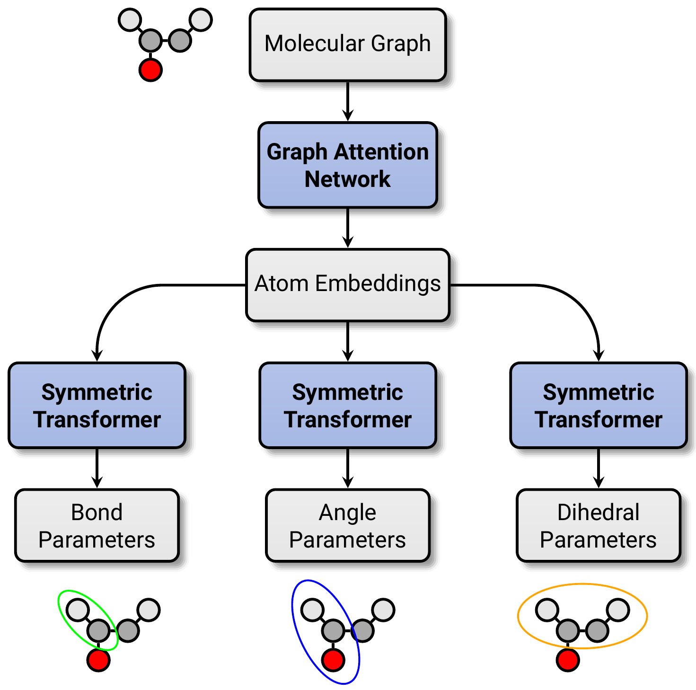
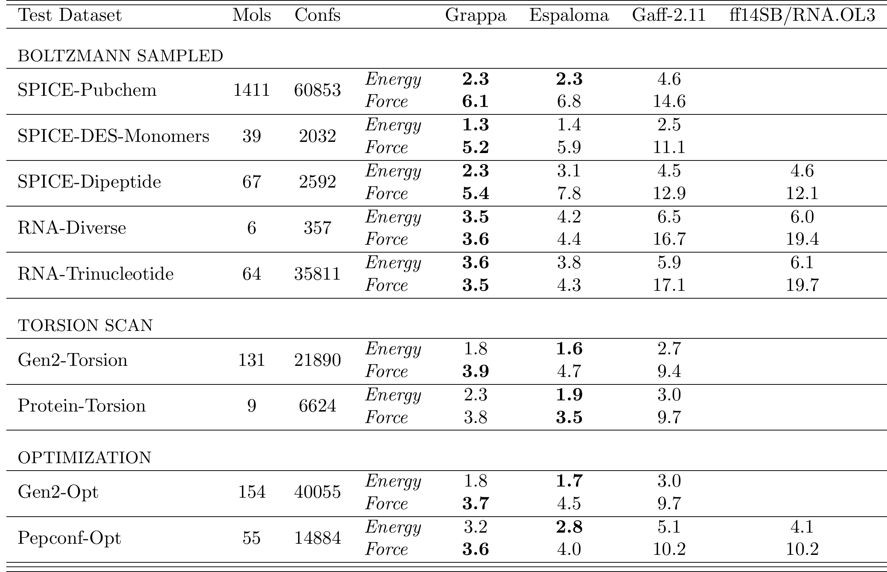
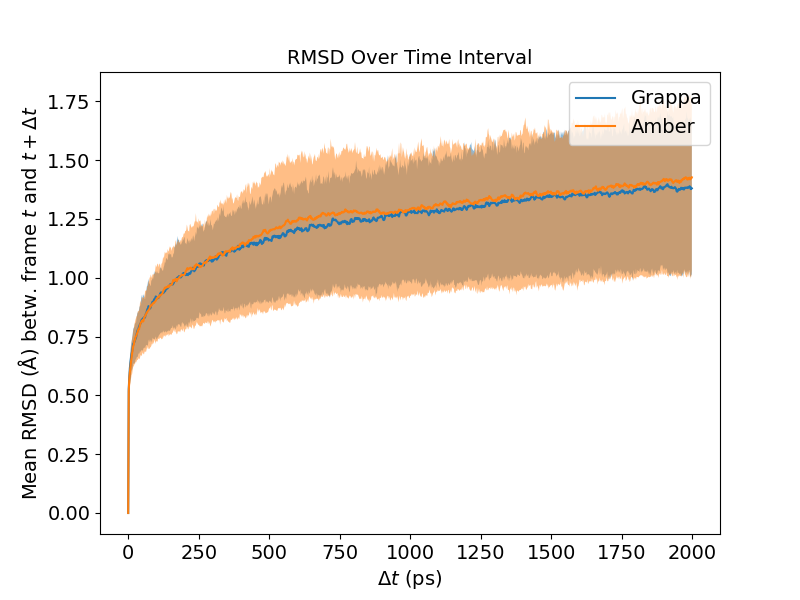
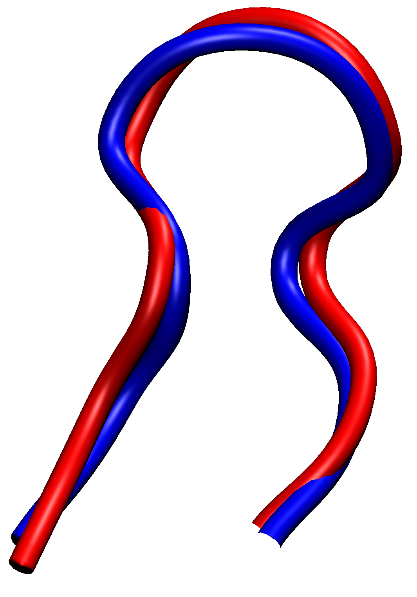
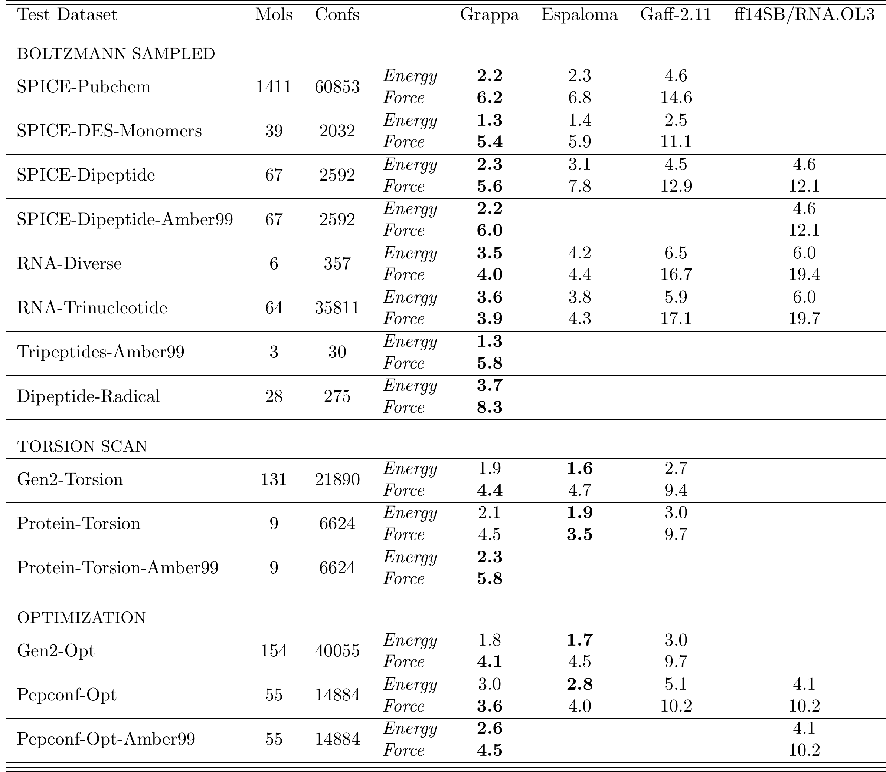
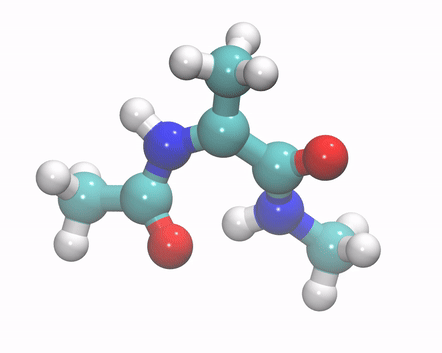
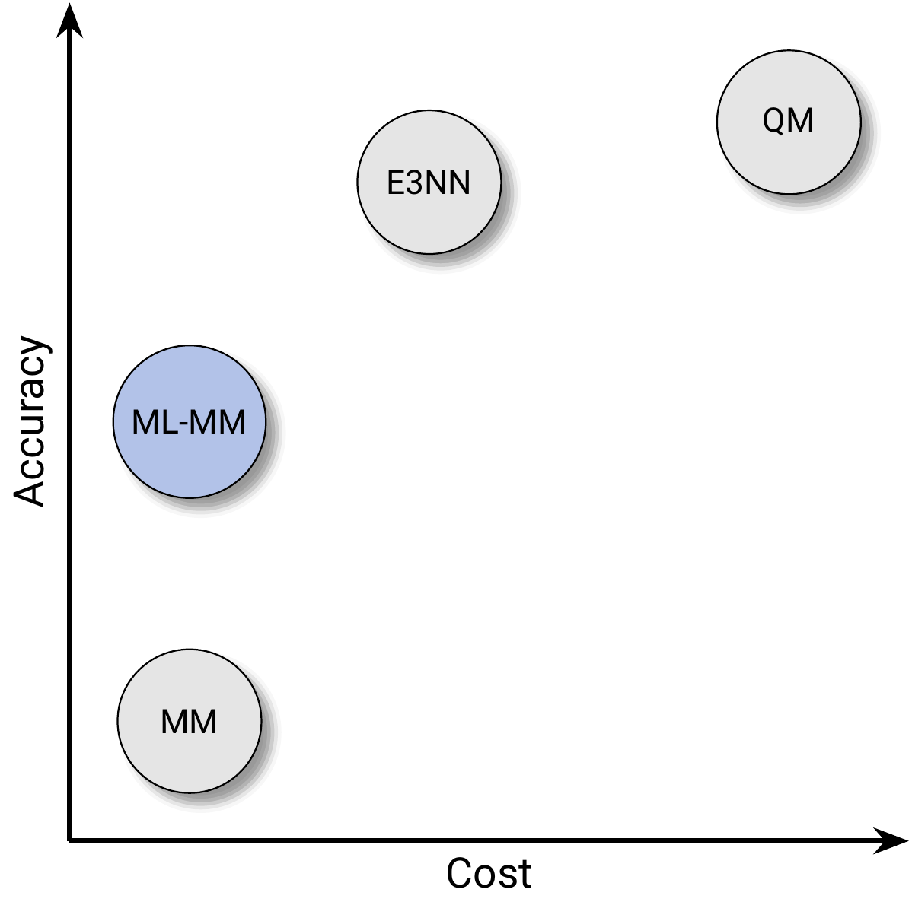
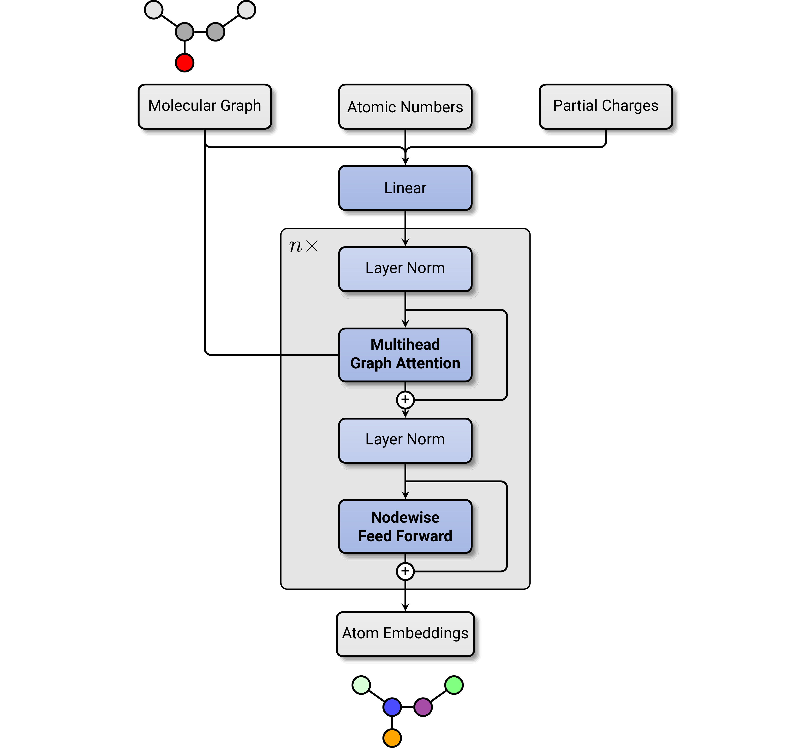
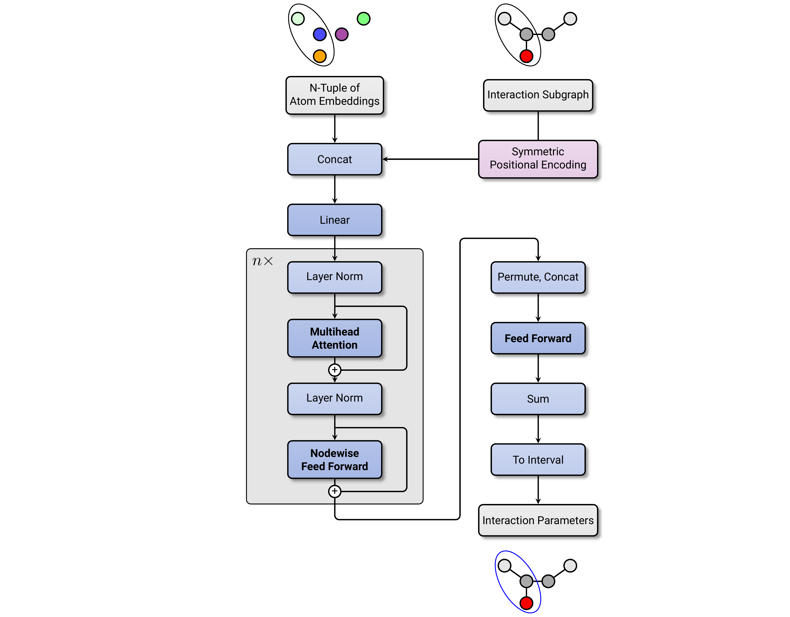

# Graph Attentional Protein Parametrization (GrAPPa)

_A machine-learned molecular mechanics force field using deep graph attention networks_


## Abstract

Simulating large molecular systems over long timescales requires force fields that are both accurate and efficient.
While E(3) equivariant neural networks are providing a speedup over computational Quantum Mechanics (QM) at high accuracy, they are several orders of magnitude slower than Molecular Mechanics (MM) force fields.

Here, we present a state of the art machine-learned MM force field that outperforms traditional and other machine-learned MM force fields [[Takaba et al. 2023](https://arxiv.org/abs/2307.07085v4)] significantly in terms of accuracy, at the same computational cost.
Our forcefield, Grappa, covers a broad range of chemical space: The same force field can parametrize small molecules, proteins, RNA and even uncommon molecules like radical peptides.
Besides predicting energies and forces at greatly improved accuracy, Grappa is transferable to large molecules. We show that it keeps Ubiquitin stable and can fold small proteins in molecular dynamics simulations.

Grappa uses a novel machine learning architecture that combines a deep attentional graph neural network and a transformer with symmetry-preserving positional encoding to predict MM parameters from molecular graphs. The current model is trained on QM energies and forces of over 14,000 molecules and over 800,000 states, and is available for use with GROMACS and OpenMM.

<details open>
  <summary>Grappa Overview</summary>
  <p align="center">
    
  </p>
  <p><i>Grappa first predicts node embeddings from the molecular graph. In a second step, it predicts MM parameters for each n-body interaction from the embeddings of the contributing nodes, respecting the necessary permutation symmetry.</i></p>
</details>

<details>
  <summary><b>Performance on MM Benchmark Datasets</b></summary>
  <p align="center">
    
  </p>
  <p><i>Grappa's energy and force-component RMSE in kcal/mol and kcal/mol/Å on the test dataset (trained with the same train-val-test partition) from Espaloma [<a href="https://arxiv.org/abs/2307.07085v4">Takaba et al. 2023</a>], compared with classical forcefields [<a href="https://pubs.aip.org/aip/jcp/article/153/11/114502/199591/A-fast-and-high-quality-charge-model-for-the-next">He et al.</a>], [<a href="https://doi.org/10.1021/acs.jctc.5b00255">Maier et al.</a>, <a href="https://pubs.acs.org/doi/10.1021/ct200162x">Zgarbova et al.</a>]</i></p>
</details>


<details open><summary><b>Table of contents</b></summary>
  
- [Usage](#usage)
- [Installation](#installation)
- [Results](#results)
  - [Grappa is state-of-the-art](#grappa-is-state-of-the-art)
  - [Grappa keeps large proteins stable](#grappa-keeps-large-proteins-stable)
  - [Grappa can fold small proteins](#grappa-can-fold-small-proteins)
  - [Grappa can parametrize radicals](#grappa-can-parametrize-radicals)
- [Method](#method)
  - [Framework](#framework)
  - [Permutation Symmetry](#permutation-symmetry)
  - [Architecture](#architecture)
- [Training](#training)
- [Datasets](#datasets)
- [Pretrained Models](#pretrained-models)
- [Reproducibility](#reproducibility)
</details>


## Usage

Grapa predicts bonded parameters, the nonbonded parameters like partial charges are predicted with a traditional force field. The input to Grappa is therefore a representation of the system of interest that already contains information on the nonbonded parameters. Currently, Grappa is compatible with GROMACS and OpenMM.

For complete example scripts, see `examples/usage`.

### GROMACS

In GROMACS, Grappa can be used as command line application that receives the path to a topology file and writes the bonded parameters in there.

```{bash}
# parametrize the system with a traditional forcefield:
gmx pdb2gmx -f your_protein.pdb -o your_protein.gro -p topology.top -ignh

# create a new topology file with the bonded parameters from Grappa, specifying the tag of the grappa model:
grappa_gmx -f topology.top -p topology_grappa.top -t grappa-1.1.0

# continue with ususal gromacs workflow
```

### OpenMM

To use Grappa in OpenMM, parametrize your system with a traditional forcefield, from which the nonbonded parameters are taken, and then pass it to Grappas Openmm wrapper class:

```{python}
from openmm.app import ForceField, Topology
from grappa import OpenmmGrappa

topology = ... # load your system as openmm.Topology

classical_ff = ForceField('amber99sbildn.xml', 'tip3p.xml')
system = classical_ff.createSystem(topology)

# load the pretrained ML model from a tag. Currently, possible tags are 'grappa-1.0', grappa-1.1' and 'latest'
grappa_ff = OpenmmGrappa.from_tag('grappa-1.1')

# parametrize the system using grappa. The charge_model tag tells grappa how the charges were obtained, in this case from the classical forcefield amberff99sbildn. possible tags are 'classical' and 'am1BCC'.
system = grappa_ff.parametrize_system(system, topology, charge_model='classical')
```


## Installation


### GROMACS

The creation of custom GROMACS topology files is handled by [Kimmdy](https://github.com/hits-mbm-dev/kimmdy), which can be installed via pip.

For simplicity, we recommend to use Grappa for GROMACS in cpu mode since the inference runtime of Grappa is usually small compared to the simulation runtime, even without a GPU. (Simply create another environment if you also intend to train Grappa.)

```{bash}
pip install kimmdy
pip install torch==2.2.0 --index-url https://download.pytorch.org/whl/cpu
pip install dgl -f https://data.dgl.ai/wheels/repo.html dglgo -f https://data.dgl.ai/wheels-test/repo.html
```

To install Grappa, simply clone the repository, install additional requirements and the package itself with pip:

```{bash}
git clone git@github.com:hits-mbm-dev/grappa.git
cd grappa
pip install -r requirements.txt
pip install .
```

### OpenMM

Unfortunately, OpenMM is not available on pip and has to be installed via conda. Since OpenMM, torch and dgl use cuda, the choice of package-versions is not trivial and is thus handled by installscripts. The installation scripts are tested on Ubuntu 22.04 and install the following versions:

| CUDA | Python | Torch | OpenMM |
|------|--------|-------|---------|
| 11.7 | 3.9    | 2.0.1 | 7.7.0   |
| 11.8 | 3.10   | 2.2.0 | 8.1.1   |
| 12.1 | 3.10   | 2.2.0 | 8.1.1   |
| cpu  | 3.10   | 2.2.0 | 8.1.1   |

Simply activate the target conda environment and run the install script for the cuda version of choice, e.g. for 12.1:

```{bash}
git clone git@github.com:hits-mbm-dev/grappa.git
cd grappa
conda create -n grappa -y
conda activate grappa
./installation_openmm.sh 12.1
```

### Development

To facilitate the interface to OpenMM and GROMACS, Grappa has an optional dependency on [OpenMM](https://github.com/openmm/openmm) and [Kimmdy](https://github.com/hits-mbm-dev/kimmdy), which is used to create custom GROMACS topology files. To train and evaluate Grappa on existing datasets, neither of these packages are needed.

In this case, Grappa only needs a working installation of [PyTorch](https://pytorch.org/) and [DGL](https://www.dgl.ai/), e.g. by

```{bash}
pip install torch==2.0.1 --index-url https://download.pytorch.org/whl/cu117
pip install  dgl -f https://data.dgl.ai/wheels/cu117/repo.html dglgo -f https://data.dgl.ai/wheels-test/repo.html
conda install cuda-toolkit -c "nvidia/label/cuda-11.7.1" -y
```

To install Grappa, simply clone the repository, install additional requirements and the package itself with pip:

```{bash}
git clone git@github.com:hits-mbm-dev/grappa.git
cd grappa
pip install -r requirements.txt
pip install .
```

Alternatively, install grappa with openmm by running the installation script provided. This will, however, take a bit longer since it will install openmm via conda.


## Results

In this section, we show that Grappa outperforms established MM force fields and the recent machine-learned Espaloma [<a href="https://arxiv.org/abs/2307.07085v4">Takaba et al. 2023</a>] force field in terms of accuracy and that it can be transfered to large molecules.

### Grappa is State-of-the-Art

We trained Grappa on the dataset (and train-validation-test partition) from Espaloma [<a href="https://arxiv.org/abs/2307.07085v4">Takaba et al. 2023</a>] and compared it with established MM force fields [<a href="https://pubs.aip.org/aip/jcp/article/153/11/114502/199591/A-fast-and-high-quality-charge-model-for-the-next">He et al.</a>], [<a href="https://doi.org/10.1021/acs.jctc.5b00255">Maier et al.</a>], [<a href="https://pubs.acs.org/doi/10.1021/ct200162x">Zgarbova et al.</a>].

The Espaloma dataset covers small molecules, peptides and RNA with states sampled from the Boltzmann distribution at 300K and 500K, from optimization trajectories and from torsion scans. For all types of molecules, Grappa outperforms established MM force fields and Espaloma in terms of force accuracy, and for Boltzmann-sampled states also in terms of energy accuracy. To the best of our knowledge, this makes it the most accurate MM force field currently available (as of February 2024).

<p align="center">
    
  </p>
  <p><i>Energy and force-component RMSE on test molecules in kcal/mol and kcal/mol/Å. The dataset is split into 80% train, 10% validation and 10% test molecules, demonstrating not transferability not only in conformational but also in chemical space.</i></p>
  

### Grappa keeps large Proteins stable

Grappa can not only accurately predict QM energies and forces, but also reproduces well-known behaviour of established protein force fields. Ubiquitin [<a href="https://www.rcsb.org/structure/1UBQ">1UBQ</a>] shows a similar magnitude of fluctuation when simulated with Grappa and <a href="https://www.ncbi.nlm.nih.gov/pmc/articles/PMC2970904/">Amberff99sbildn</a>.

<p align="center">
    
  </p>
  <p><i>RMSD Distribution between states with a given time difference during 40 ns of MD simulation of Ubiquitin in solution at 300K. The shaded area corresponds to the range between the 25th and 75th percentile.</i></p>

### Grappa can fold small Proteins

We have simulated the small protein Chignolin in solution starting from an unfolded configuration and observed that it folds into the experimentally measured state [1UAO](https://www.rcsb.org/structure/1UAO) on a timescale of microseconds. We identified a cluster of folded states whose center has an C-alpha RMSD of 1.1 Å compared to 1.0 Å obtained in the same setting with <a href="https://www.ncbi.nlm.nih.gov/pmc/articles/PMC2970904/">Amberff99sbildn</a> in [Lindorff-Larsen et al.](https://www-science-org.ubproxy.ub.uni-heidelberg.de/doi/epdf/10.1126/science.1208351).

<p align="center">
    
  </p>
  <p><i>The cluster center of Chignolin during an MD simulation using Grappa (blue) and the experimentally measured structure.</i></p>


### Grappa 1.0

The published model grappa-1.0 has been trained on an extension of the Espaloma dataset that contains Boltzmann-sampled states of tripeptides and radical dipeptides that can be formed by hydrogen atom transfer. For the peptide datasets in Espaloma, we also calculate nonbonded contributions with <a href="https://www.ncbi.nlm.nih.gov/pmc/articles/PMC2970904/">Amberff99sbildn</a> instead of am1BCC (as is done in Espaloma). We split the dataset into 80% train, 10% validation and 10% test molecules using the same partition as Espaloma.

<p align="center">
    
  </p>
  <p><i>Energy and force-component RMSE on test molecules in kcal/mol and kcal/mol/Å. Grappa can differentiate between the optimal bonded parameters for molecules whose nonbonded interaction is modeled with am1BCC-charges and amber99sbildn-charges.</i></p>
  

### Grappa can parametrize Radicals

Unlike many other machine-learned force fields, Grappa does not rely on hand-crafted input features from Cheminformatics-tools but only on the molecular graph and partial charges as input. This makes it applicable beyond the coverage of existing Cheminformatics-tools, for example to radicals.

Grappa 1.0 has been trained on radical peptides that can be formed by hydrogen atom transfer, i.e. that 'miss' a hydrogen (as opposed to being protonated). Grappa is the first MM force field capable of accurately simulating radical peptides. To demonstrate this, we simulate a small radical peptide that undergoes a hydrogen atom transfer in [KIMMDY](https://github.com/hits-mbm-dev/kimmdy), a GROMACS extension for reactive MD via kinetic Monte Carlo methods.

<p align="center">
    
  </p>
  <p><i>Example simulation of a hydrogen atom transfer in a small radical peptide to demonstrate that the effect of the radical carbon on the geometry is captured with Grappa.</i></p>


## Method

Grappa is a machine learning framework to predict MM parameters from the molecular graph. Since this prediction does not depend on the conformation of the molecule, it has to be done only once. Then, the prediction of energies and forces has the same computational speed as MM.

<p align="center">
    
  </p>
  <p><i>Machine learning lifts the tension between accuracy and speed of force fields. E(3) equivariant neural networks offer highly accurate predictions at improved speed; machine-learned MM is capable of significantly more accurate predictions at the same speed as conventional MM.</i></p>

In analogy to the atom-typing by hand-crafted rules in conventional MM force fields, Grappa first predicts atom embeddings from the molecular graph. These give the model the freedom to encode the local chemical environment of each atom in a high-dimensional feature vector. In a second step, Grappa predicts the parameters of each N-body MM-interaction from the N embeddings of the involved atoms.

At the moment, Grappa only predicts bonded parameters, nonbonded parameters like partial charges and Lennard-Jones parameters are taken from a classical force field of choice. Grappa is trained on nonbonded parameters by [openff-2.0.0](https://chemrxiv.org/engage/chemrxiv/article-details/637938cbe70b0a110aa33b8b) and [Amberff99sbildn](https://www.ncbi.nlm.nih.gov/pmc/articles/PMC2970904/). The reason for this is that we want to retain established statistical properties like melting points or folding states.

### Architecture

For the graph neural network that is supposed to predict atom embeddings, we modify graph attention networks [Veličković et al.](https://arxiv.org/abs/1710.10903) by scaled, dotted multihead attention, skip connections, dropout, layer norm and nodewise feed forward layers in analogy to the transformer architecture [Vaswani et al.](https://arxiv.org/abs/1706.03762).

<p align="center">
    
  </p>
  <p><i>The architecture of Grappas Graph Neural Network</i></p>

We then predict MM parameters from atom embeddings with four independent models; one for each parameter type. The energy contribution from an MM interaction must have the same permutation symmetry as the corresponding subgraph. We achieve this by constructing permutation equivariant layers using attention followed by a symmetric pooling operation: We concatenate the node features for all node permutations that should satisfy the respective symmetry, pass each permuted version through the same feed forward network and then sum up the result. In the equivariant layers, we allow the model to break unnecessary permutation symmetries by introducing a positional encoding that is symmetric only under those permutations for which we demand the symmetry. We call this novel architecture that preserves special symmetries in a very general fashion the 'Symmetric Transformer'.

Finally, we map the range of real numbers to the physically sensible range of MM parameters using modified versions of the sigmoid function and the shifted ELU. E.g. the equilibrium bond length is enforced to be positive and the equilibrium angle is enforced to be between 0 and pi.

<p align="center">
    
  </p>
  <p><i>The architecture of Grappas Symmetric Transformer</i></p>


## Pretrained Models

Pretrained models can be obtained by using `grappa.utils.run_utils.model_from_tag` with a tag (e.g. `latest`) that will point to a url that points to a version-dependent release file, from which model weights are downloaded. An example can be found at `examples/usage/openmm_wrapper.py`. For full reproducibility, one can also obtain the model weights toghether with the respective partition of the dataset and the configuration file used for training by `grappa.utils.run_utils.model_dict_from_tag`, which returns a dictionary with the keys `{'state_dict', 'config', 'split_names', 'results','ds_size'}`.


## Datasets

Datasets of dgl graphs representing molecules can be obtained by using the `grappa.data.Dataset.from_tag` constructor. An example can be found at `examples/usage/evaluation.py`. Available tags are listed in the documentation of the Dataset class.

To re-create the benchmark experiment, also the splitting into train/val/test sets is needed. This can be done by running `dataset_creation/get_espaloma_split/save_split.py`, which will create a file `espaloma_split.json` that contains lists of smilestrings for each of the sub-datasets. These are used to classify molecules as being train/val/test molecules upon loading the dataset in the train scripts from `experiments/benchmark`.

## Reproducibility

Every Grappa model that is published does not only contain the model weights but also a config dict that describes hyperparameters of the model and training and the split of the dataset into train/val/test molecules. This allows seamless reproducibility in a few lines of code. For example, to reproduce the training of Grappa 1.0, one can simply run:

```{python}
from grappa.utils.run_utils import model_dict_from_tag
from grappa.utils.loading_utils import model_dict_from_tag
from grappa.training.trainrun import do_trainrun
import json

model_dict = model_dict_from_tag('grappa-1.1.0')

split_ids = model_dict['split_names']
json.dump(split_ids, open('split_ids.json', 'w'))

config['data_config']['splitpath'] = splitpath

do_trainrun(config=config, project='reproduce-grappa')
```