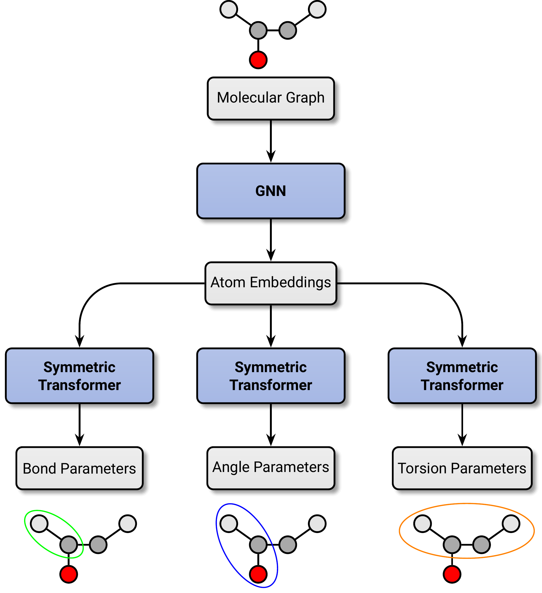

# Graph Attentional Protein Parametrization (GrAPPa)

A machine-learned molecular mechanics force field using deep graph attention networks.



## Usage

Currently, Grappa is compatible with GROMACS and OpenMM. To use Grappa in openmm, parametrize your system with a classical forcefield, from which the nnbonded parameters are taken, and then pass it to Grappas Openmm wrapper class:

```{python}
import openmm
from grappa.utils.loading_utils import model_from_tag
from grappa.wrappers.openmm_wrapper import openmm_Grappa

model = model_from_tag('grappa-1.0')

topology = ... # load your system as openmm.app.Topology

classical_ff = openmm.app.ForceField('amber99sbildn.xml', 'tip3p.xml')
system = classical_ff.createSystem(topology)

grappa_ff = openmm_Grappa(model)

system = grappa.parametrize_system(system, topology)
```

Note that the current version of the OpenMM wrapper will parametrize the whole topology with Grappa, including the solvent. Grappa is not trained to parametrize water, the solvent should thus be removed from the topology before parametrization. In future versions, there will be the option to parametrize only a subset of the topology.

More: See `examples/usage`.

## Installation

### Installation

Unfortunately, openmm is not available on pip and has to be installed via conda. Since openmm, torch and dgl use cuda, the choice of package-versions is not trivial and is thus handled by installscripts. The installation scripts are tested on Ubuntu 22.04 and install the following versions:

| CUDA | Python | Torch | OpenMM |
|------|--------|-------|---------|
| 11.7 | 3.9    | 2.0.1 | 7.7.0   |
| 11.8 | 3.10   | 2.2.0 | 8.1.1   |
| 12.1 | 3.10   | 2.2.0 | 8.1.1   |
| cpu  | 3.10   | 2.2.0 | 8.1.1   |

Simply activate the target conda environment and run the install script for the cuda version of choice, e.g. for 12.1:
```{bash}
conda create -n grappa -y
conda activate grappa
./installation_121.sh
```


### Manual Installation

Alternatively, you can install grappa manually by the following steps:

Unfortunately, openmm is not available on pip and has to be install via conda. It is recommended to use the openmm=7.7.0=py39hb10b54c_0 version.

DGL has to be installed separately since index files are needed ([dgl installation](https://www.dgl.ai/pages/start.html)). Modify the cuda version in the script below to your needs.

```{bash}
git clone git@github.com:hits-mbm-dev/grappa.git
cd grappa

conda create -n grappa python=3.9 openmm=7.7.0=py39hb10b54c_0 -c conda-forge -y
conda activate grappa

pip install torch==2.1.0 pytorch-cuda=11.7

pip install -r requirements.txt

pip install dgl -f https://data.dgl.ai/wheels/cu117/repo.html
pip install dglgo -f https://data.dgl.ai/wheels-test/repo.html

pip install -e .
```

## Pretrained Models

Pretrained models can be obtained by using `grappa.utils.run_utils.model_from_tag` with a tag (e.g.`latest`) that will point to a url that points to a version-dependent release file, from which model weights are downloaded. An example can be found at `examples/usage/openmm_wrapper.py`.

## Datasets

Datasets of dgl graphs representing molecules can be obtained by using the `grappa.data.Dataset.from_tag` constructor. An example can be found at `examples/usage/evaluation.py`. Available tags are listed in the documentation of the Dataset class.

To re-create the benchmark experiment, also the splitting into train/val/test sets is needed. This can be done by running `dataset_creation/get_espaloma_split/save_split.py` has to be run. This will create a file `espaloma_split.json` that contains lists of smilestrings for each of the sub-datasets. These are used to classify molecules as being train/val/test molecules upon loading the dataset in the train scripts from `experiments/benchmark`.